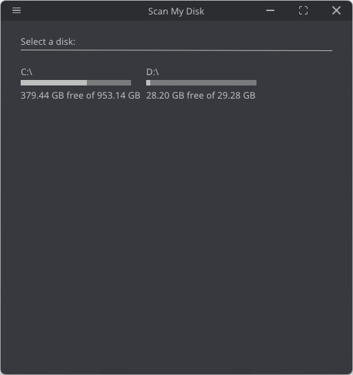
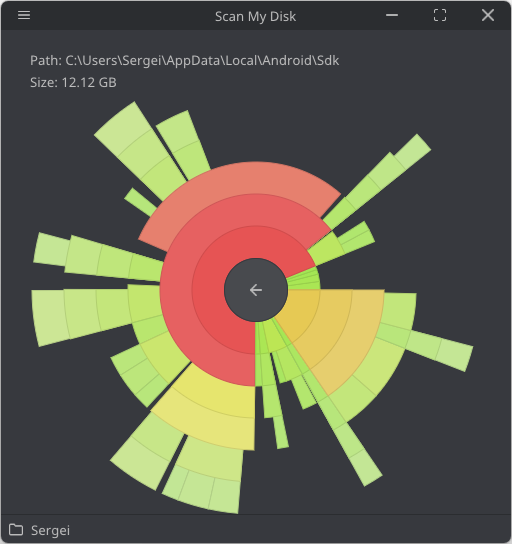

# Scan My Disk

Welcome to Scan My Disk — the user-friendly, open-source utility that simplifies your storage management. See at a glance which files and folders are using your disk space with our interactive pie chart. It's designed for easy use and supports multiple languages, including Chinese, Japanese, and Korean. Suitable for both Windows and macOS, Scan My Disk helps keep your computer organized and your storage well-managed.  Start your digital cleanup today!




## Goals
I've always been a fan of the [Scanner utility by Steffen Gerlach](http://steffengerlach.de/freeware/index.html), but unfortunately, as the size of my disk grew, it became slower and slower, and it seems the Scanner project has ceased development.

I thought it would be beneficial and interesting to write an analog of this utility myself, as I've never developed such a project before. Thus, I began working on Scan My Disk. The main goals I aim to achieve in this project are:

### High Performance:
High-performance scanning and display for quick and effective processing of large and complex file systems.

### User-Friendly and Accessible:
An intuitive and accessible application with a user-friendly interface, supporting multiple languages and platforms, including mobile platforms.

### Enhanced File Operations:
The ability to perform direct file operations from the application, such as deleting, moving, or archiving files.

## How to Use
You can download the pre-built versions of the application from the Releases section for your Windows or macOS. Alternatively, you can build the application yourself. All necessary libraries and dependencies are already in the repository, so you'll just need to clone it.

## Building
To build the application, you will need the latest versions Xcode for macOS or Visual Studio 2022 for Windows, with support for C++20.

### Clone the Repository
```
git clone git@github.com:belov-sergei/scan-my-disk.git
```

### Navigate to the Project Root
```
cd scan-my-disk
```

### Create a Build Directory
```
mkdir Build
cd Build
```

### Run CMake
```
cmake .. -G "Your Generator"
```

### Build the Project
Once the build configuration is generated, the simplest way to compile the application is to open the generated solution file in your IDE and run the build project.

## Upcoming Plans

In the near future, I am focusing on several improvements and new features to enhance Scan My Disk:

### Code Refactoring:
- Organize and clean up the current codebase. Much of the code was initially written quickly to test core functionalities. I plan to revisit and refine the architecture and code quality.

### Interface Enhancement:
- Improve the program's interface to make it more attractive. I aim to add color schemes and overall design improvements for a better user experience.

### Operating System Integration:
- Enhance integration with different operating systems to ensure smoother performance and better user interaction across various platforms.

### Navigation Features:
- Implement new navigation features for disk and diagram exploration, making it easier to understand and manage file distribution and disk space.

### Memory Optimization:
- Optimize memory usage to ensure the application runs efficiently, especially when handling large files and complex directory structures.

### Performance Boost:
- Continue to improve the scanning and processing speed to handle growing disk sizes and complex file systems, ensuring a high-performance experience for all users.

## License

This project is distributed under the GNU General Public License v3.0. This means that you are free to use, modify, and share this software, provided that all derivative works are distributed under the same license. You must also provide access to the source code when distributing the program. For more detailed information about your rights and responsibilities, please refer to the [full text of the GPL 3 License](https://www.gnu.org/licenses/gpl-3.0.html).

## Third-Party Libraries and Resources

### Libraries:
  - [fmtlib/fmt](https://github.com/fmtlib/fmt) - A modern formatting library providing a faster and safer alternative to C's printf and C++'s iostreams.
  - [google/googletest](https://github.com/google/googletest) - Google's C++ test framework, offering rich assertions and test organization.
  - [ocornut/imgui](https://github.com/ocornut/imgui) - A bloat-free graphical user interface library for C++ with minimal dependencies.
  - [libsdl-org/SDL](https://github.com/libsdl-org/SDL) - Simple DirectMedia Layer, a cross-platform development library designed to provide low-level access to audio, keyboard, mouse, joystick, and graphics hardware.
  - [nothings/stb](https://github.com/nothings/stb) - A range of single-file libraries for C/C++ development, primarily for media processing and creation.
  - [zeux/pugixml](https://github.com/zeux/pugixml) - A light-weight, simple and fast XML parser for C++ with XPath support.

### Fonts:
  - [Noto Sans](https://fonts.google.com/noto/specimen/Noto+Sans) - A font family from Google that aims to support all languages with a harmonious look and feel.

### Icons:
  - [OpenFontIcons](https://github.com/traverseda/OpenFontIcons) - A collection of open-source icon fonts, providing scalable vector icons that can instantly be customized.

## How to Contribute

I would welcome any help you can provide to make Scan My Disk better! Whether you're fixing bugs, improving documentation, adding new features, or helping with translations, your contributions are appreciated. Here's how you can get involved:

### Reporting Bugs:
- **Find a Bug?** Create an issue in the repository with a detailed description, including steps to reproduce it and the expected outcome.

### Suggesting Enhancements:
- **Have an idea?** Open an issue with the tag "Enhancement". Describe your idea for a feature or improvement, including any supporting documentation or references.

### Code Contributions:
- **Want to code?** Great! Start by looking at the open issues, especially those tagged as "Good First Issue" or "Help Wanted".
- **Make a Pull Request:** Fork the repository, make your changes, and submit a pull request. Please ensure your code adheres to the existing style to keep the project consistent.
- **Code Review:** Once submitted, your pull request will be reviewed. Engage in the conversation and be open to making changes based on feedback.

### Language and Translations:
- **Check and Improve Translations:** Review existing translations for accuracy and fluency. Suggest changes or updates where needed.
- **Add a New Language:** If you are fluent in a language that Scan My Disk doesn't yet support, consider adding it! This will help make the tool more accessible to users worldwide.

### Spreading the Word:
- **Star the project on GitHub:** Show your support and help increase the project's visibility.
- **Share with Others:** If you find Scan My Disk useful, consider sharing it with others who might benefit from it.

Thank you for considering to contribute to Scan My Disk!